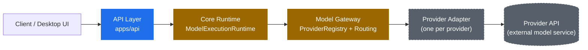

# RITRON AI

**A local-first, provider-agnostic AI desktop platform.**

[](https://github.com/subhranshu-dev/Ritron-Ai/actions/workflows/ci.yml)


## What is RITRON AI

RITRON AI is a production-oriented, desktop-native platform for interacting
with AI models, agents, tools, memory, and knowledge through a single,
provider-agnostic runtime. It is not a website or a thin wrapper around one
vendor's API — it is architected as a layered system that separates the HTTP
surface, execution orchestration, model routing, and provider-specific
integration code into independently replaceable boundaries, so the platform
can support multiple AI providers without coupling the rest of the system to
any one of them.

**Status:** private, pre-release, foundation stage. The engineering
foundation (Step 01) is implemented and enforced by CI; the core runtime and
model gateway contracts (Step 02) are in active development. No product
surface — agents, tools, memory, knowledge, desktop UI — exists yet.

**License:** this repository is private and proprietary. All rights
reserved; no license is granted to use, copy, modify, or distribute this
software except under a separate written agreement. See [LICENSE](LICENSE).

## Vision

RITRON is intended to grow into a modular, provider-agnostic AI platform
where a user can connect different AI models and providers and interact with
all of them through one consistent runtime, running locally by default and
extending to cloud services only when explicitly enabled. The long-term
direction includes an agent runtime, a tool system, persistent memory and
knowledge retrieval, Model Context Protocol (MCP) integration, user-defined
automation, and a native desktop application — each introduced only at its
roadmap milestone, not built ahead of sequence.

The sections below distinguish what exists today from what is still planned;
nothing described as "planned" or "in development" should be read as
shipped.

## Current Architecture

### Step 01 — Core API foundation (implemented)

The API foundation (`apps/api`) is a FastAPI service that currently exposes
only operational endpoints:

- `GET /health/live`, `GET /health/ready`
- Request correlation via an `X-Request-ID` header, threaded through every
  log line and error response
- Structured JSON logging with automatic redaction of credential-like fields
  (`api_key`, `token`, `password`, `secret`, `authorization`)
- A safe error envelope that never leaks tracebacks or internal paths

### Step 02 — Core Runtime & Model Gateway contracts (in development)

The provider-agnostic execution layer already exists in code but is not yet
wired to the running API and has no concrete provider adapters:

- `core/runtime.py` — `ModelExecutionRuntime`, a provider-agnostic execution
  orchestrator with telemetry hooks, independent of HTTP
- `model_gateway/contracts.py` — stable, provider-independent request,
  response, and streaming-event types
- `model_gateway/provider.py`, `model_gateway/registry.py` — the
  `ModelProvider` protocol and a `ProviderRegistry` that provider adapters
  will implement and register against

### Intended request flow



**Legend:** blue = implemented, amber = in development, gray/dashed =
planned.

### Why provider-specific code stays inside adapters

Provider SDKs, vendor authentication schemes, and provider-specific
request/response shapes are only permitted inside a Provider Adapter. The
Core Runtime, Model Gateway, and everything above them interact solely
through the contracts in `model_gateway/contracts.py` and the
`ModelProvider` protocol. This is what lets RITRON add or swap AI providers
without touching orchestration code or anything the rest of the platform
depends on, and it is what keeps local-only operation possible — nothing
above the adapter boundary requires network access to a specific vendor.

## Major Planned Subsystems

| Subsystem               | Status               | Description                                                                                                                        |
| ----------------------- | -------------------- | ---------------------------------------------------------------------------------------------------------------------------------- |
| **Core Runtime**        | 🚧 In development    | Provider-agnostic execution orchestration; not yet exposed via the API.                                                            |
| **Model Gateway**       | 🚧 In development    | Stable model contracts, provider registry, routing/retry scaffolding; no provider adapters yet.                                    |
| **Agent Runtime**       | ⬜ Planned           | Multi-step agent execution, planning, and tool invocation.                                                                         |
| **Tool System**         | ⬜ Planned           | Registration and controlled execution of callable tools.                                                                           |
| **Memory**              | ⬜ Planned           | Short- and long-term memory for agents and conversations.                                                                          |
| **Knowledge**           | ⬜ Planned           | Indexing and retrieval over user knowledge sources.                                                                                |
| **Security**            | ⬜ Planned           | Permission engine and tool-execution sandbox (Step 09). See [Quality and Security](#quality-and-security) for what already exists. |
| **MCP**                 | ⬜ Planned           | Model Context Protocol integration for external tool/context servers.                                                              |
| **Automation**          | ⬜ Planned           | User-defined automations and workflows spanning agents and tools.                                                                  |
| **Desktop Application** | ⬜ Planned (Step 12) | Tauri 2 + Rust + React native shell; `apps/desktop` is reserved and empty.                                                         |
| **Cloud/Sync**          | ⬜ Planned           | Optional cloud sync; local-first operation remains mandatory regardless.                                                           |
| **Integrations**        | ⬜ Planned           | Future integrations with external services beyond model providers.                                                                 |

## Technology Stack

| Layer                   | Technology                                                      |
| ----------------------- | --------------------------------------------------------------- |
| API service             | Python 3.13, FastAPI, Uvicorn                                   |
| Native foundation       | Rust 1.97.1 (`crates/ritron-foundation`)                        |
| Tooling / config        | TypeScript, Node.js 22 LTS                                      |
| Package management      | pnpm 10.18.3 (JS), uv (Python), Cargo (Rust)                    |
| Linting                 | ESLint (JS/TS), Ruff (Python), Clippy (Rust)                    |
| Formatting              | Prettier (JS/TS/Markdown), Ruff format (Python), rustfmt (Rust) |
| Type checking           | tsc (TypeScript), mypy (Python)                                 |
| Testing                 | pytest (unit, integration, e2e)                                 |
| CI/CD                   | GitHub Actions (`.github/workflows/ci.yml`)                     |
| Dependency auditing     | pip-audit (Python), `pnpm audit` (Node)                         |
| Secret scanning         | gitleaks                                                        |
| Planned, not yet in use | Tauri 2, React (desktop shell, Step 12)                         |

## Repository Structure

| Location                   | Purpose                                                                                                                                                                    |
| -------------------------- | -------------------------------------------------------------------------------------------------------------------------------------------------------------------------- |
| `apps/api`                 | Implemented Python/FastAPI core API foundation, including the in-development Core Runtime and Model Gateway contracts.                                                     |
| `apps/desktop`             | Reserved for the Step 12 Tauri 2 + Rust + React desktop shell. Empty by design.                                                                                            |
| `crates/ritron-foundation` | Rust foundation crate shared by future native components.                                                                                                                  |
| `docs/`                    | Architecture, development, testing, and deployment guides; see [Documentation](#documentation).                                                                            |
| `docs/decisions/`          | Architecture decision records (ADRs).                                                                                                                                      |
| `infrastructure/`          | Reserved for Docker, CI, deployment, and monitoring artifacts as they become real. Currently unpopulated — CI runs directly on GitHub Actions.                             |
| `scripts/`                 | Cross-platform command orchestration (`scripts/run.mjs`) backing every `pnpm` script.                                                                                      |
| `tests/`                   | Reserved cross-cutting test boundaries (`unit/`, `integration/`, `e2e/`, `agent-evals/`, `security/`). Component tests live beside their component, e.g. `apps/api/tests`. |
| `.github/`                 | CI workflow, issue templates, pull request template.                                                                                                                       |

## Development

### Prerequisites

- Git
- Node 22 LTS and Corepack
- pnpm 10.18.3 (activated by Corepack)
- uv and Python 3.13
- Rust 1.97.1 with `clippy` and `rustfmt`

### Setup

```bash
corepack enable
corepack prepare pnpm@10.18.3 --activate
uv python install 3.13
rustup toolchain install 1.97.1 --component clippy,rustfmt
pnpm install --frozen-lockfile
uv sync --frozen --all-groups
```

Copy `.env.example` to `.env` only when local overrides are needed. Never
commit `.env`.

Install local git hooks after dependencies are available:

```bash
uv run pre-commit install --hook-type pre-commit --hook-type pre-push
```

### Commands

| Command                 | Purpose                                                                           |
| ----------------------- | --------------------------------------------------------------------------------- |
| `pnpm dev`              | Start the local API on `127.0.0.1:8000`.                                          |
| `pnpm build`            | Validate TypeScript, build the Python distribution, and build the Rust workspace. |
| `pnpm test`             | Run all API tests.                                                                |
| `pnpm test:unit`        | Run unit tests.                                                                   |
| `pnpm test:integration` | Run integration tests.                                                            |
| `pnpm test:e2e`         | Run public API contract tests.                                                    |
| `pnpm lint`             | Run JavaScript, Python, and Rust linters.                                         |
| `pnpm format`           | Format supported source files.                                                    |
| `pnpm format:check`     | Verify formatting without changing files.                                         |
| `pnpm typecheck`        | Run TypeScript (`tsc`) and Python (`mypy`) type checks.                           |
| `pnpm check`            | Run the complete local quality gate: format check, lint, typecheck, test, build.  |
| `pnpm clean`            | Remove local build and test artifacts.                                            |

## Quality and Security

Everything below is enforced automatically by `pnpm check` and/or the CI
workflow (`.github/workflows/ci.yml`):

- **Automated testing** — pytest unit, integration, and end-to-end contract
  suites.
- **Linting** — ESLint, Ruff, and Clippy across the three toolchains.
- **Formatting** — Prettier, Ruff format, and rustfmt, checked in CI and
  applied locally with `pnpm format`.
- **Type checking** — `tsc --noEmit` and `mypy`.
- **CI** — a Linux quality gate runs formatting, linting, type checks,
  tests, and a build on every pull request, plus a separate secret-scanning
  job.
- **Dependency auditing** — `pip-audit` for Python and `pnpm audit --prod`
  for Node dependencies run in CI.
- **Secret scanning** — gitleaks scans tracked content in CI on every pull
  request.
- **Request IDs** — every request is assigned or propagates an
  `X-Request-ID`, returned on the response and attached to every log line
  for that request.
- **Structured logging** — all API logs are emitted as single-line JSON with
  a stable schema (timestamp, level, service, environment, request ID,
  event, message).
- **Secret redaction** — log fields matching common credential names
  (`api_key`, `token`, `password`, `secret`, `authorization`) are redacted
  before logs are written.

Security controls beyond this foundation — a permission engine and
tool-execution sandbox — are planned for Step 09 and do not exist yet. See
[SECURITY.md](SECURITY.md) for the reporting policy and current control
scope.

## Contribution Workflow

This repository is private and accepts changes only through reviewed pull
requests. Contributors must not push directly to `main`.

```
Issue → Branch → Implementation → Tests → Pull Request → CI → Code Review → Merge
```

1. Open or pick up an issue describing the change.
2. Create a focused branch from `main` using a prefix that matches the
   change: `feature/`, `fix/`, or `docs/`.
3. Implement the change within the active roadmap milestone — see
   [docs/architecture.md](docs/architecture.md) before adding anything
   ahead of sequence.
4. Add or update tests for the behavior you changed.
5. Run `pnpm check` locally before opening a pull request.
6. Open a pull request describing the behavior, validation performed, and
   any configuration impact.
7. CI must pass (Linux quality gate and secret scan).
8. Address code review feedback, then merge once approved.

See [CONTRIBUTING.md](CONTRIBUTING.md) for the full policy.

## Roadmap

| Milestone | Scope                                                                   | Status         |
| --------- | ----------------------------------------------------------------------- | -------------- |
| Step 01   | Core API foundation (health, logging, request correlation, safe errors) | ✅ Complete    |
| Step 02   | Core Runtime and Model Gateway contracts                                | 🚧 In Progress |
| —         | Agent Runtime                                                           | ⬜ Planned     |
| —         | Tool System                                                             | ⬜ Planned     |
| —         | Memory                                                                  | ⬜ Planned     |
| —         | Knowledge                                                               | ⬜ Planned     |
| Step 09   | Security: permission engine, tool sandbox                               | ⬜ Planned     |
| —         | MCP integration                                                         | ⬜ Planned     |
| —         | Automation                                                              | ⬜ Planned     |
| Step 12   | Desktop application (Tauri 2 shell)                                     | ⬜ Planned     |
| Step 13   | UI layer                                                                | ⬜ Planned     |
| —         | Cloud/Sync                                                              | ⬜ Planned     |
| —         | Integrations                                                            | ⬜ Planned     |

Milestones without a step number are not yet sequenced on the roadmap; their
position is intentionally undefined until the preceding milestones land.

## Documentation

- [docs/architecture.md](docs/architecture.md) — current milestone chain and
  subsystem boundaries.
- [docs/development.md](docs/development.md) — toolchain conventions and
  configuration rules.
- [docs/testing.md](docs/testing.md) — how the test suites are organized.
- [docs/deployment.md](docs/deployment.md) — deployment posture for this
  step.
- [docs/repository.md](docs/repository.md) — what each top-level directory
  owns.
- [docs/decisions/](docs/decisions/) — architecture decision records.
- [SECURITY.md](SECURITY.md) — security policy and reporting.
- [CONTRIBUTING.md](CONTRIBUTING.md) — contribution policy.
